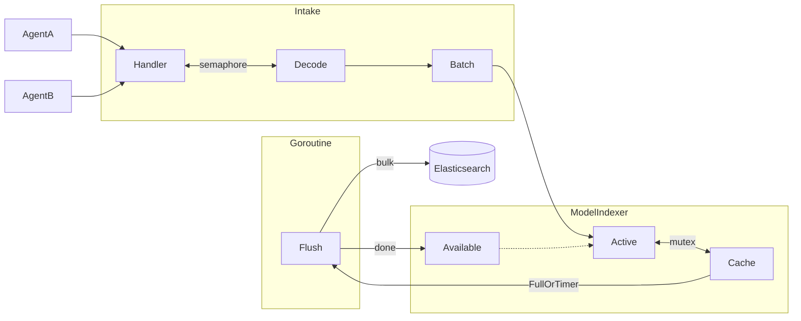
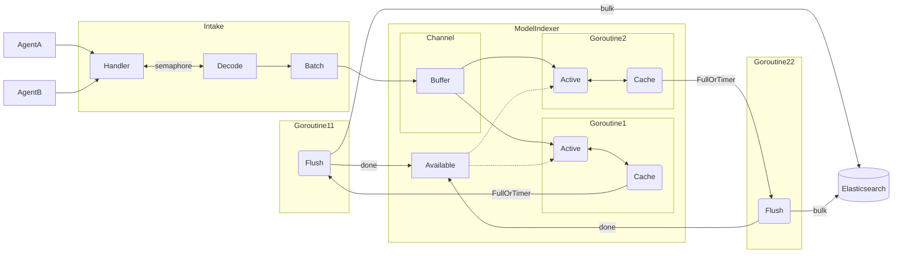

# go-docappender

go-docappender provides a Go API for append-only Elasticsearch document indexing.

## License

This software is licensed under the [Apache 2 license](https://github.com/elastic/go-docappender/blob/main/LICENSE).

## Design

`go-docappender` is an evolution of the [Elastic APM Server](https://github.com/elastic/apm-server) Elasticsearch output,
and was formerly known as `modelindexer`.

Prior to 8.0, APM Server used the libbeat Elasticsearch output. 8.0 introduced a new output called "modelindexer", which
was coupled to the APM Server event data model and optimised for APM Server's usage. From 8.0 until 8.5, modelindexer
processed events synchronously and used mutexes for synchronized writes to the cache. This worked well, but didn't seem
to scale well on bigger instances with more CPUs.

In APM Server 8.6.0, modelindexer was redesigned to accept events asynchronously, and run one or more "active indexers",
which would each pull events from an in-memory queue and (by default) compress them and write them to a buffer. This
approach reduced lock contention, and allowed for automatically scaling the number of active indexers up and down based
on queue utilisation, with an upper bound based on the available memory.

## Releasing

We use GitHub releases to manage tagged releases, and aim to conform to semver
in our release naming.

To create a new release, use the [new release
interface](https://github.com/elastic/go-docappender/releases/new), and use
GitHub's `generate release notes` to get an automatically-generated list of
changes made since the last release.
